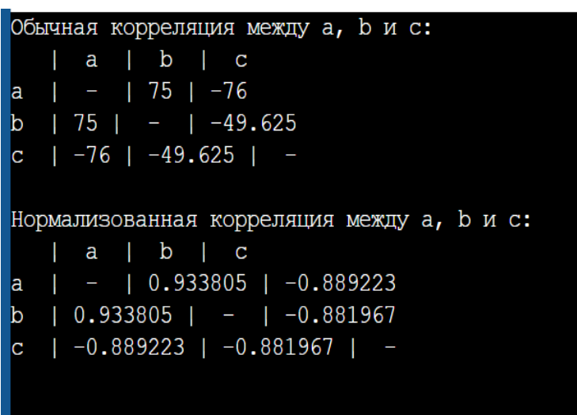
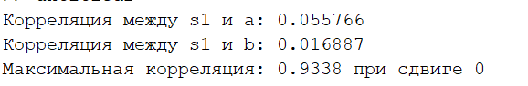
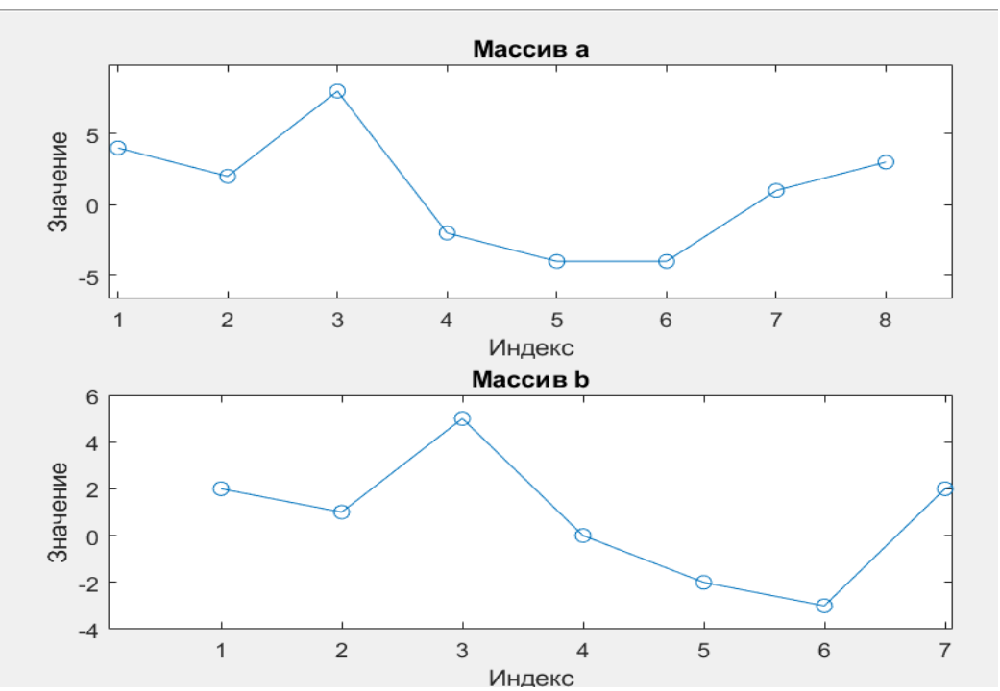
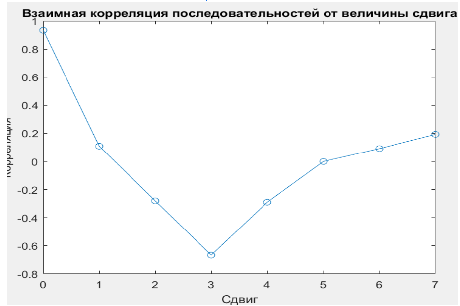
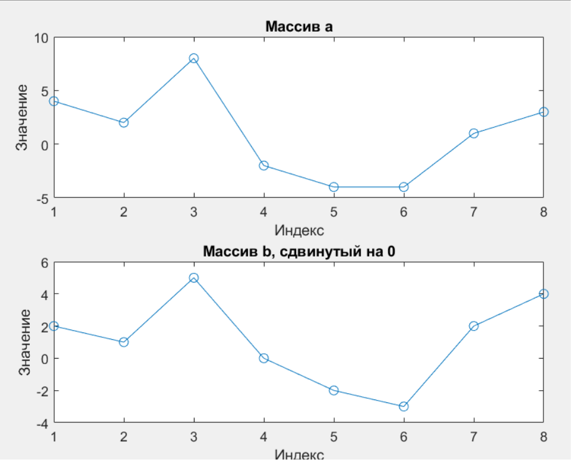

# Lab3

## Цель работы
Получить представление о том, что такое корреляционная функция и нормализованная взаимная корреляционная функция, как они вычисляются и какое отношение имеют к процедурам синхронизации в сетях мобильной связи.

## Задачи
- Изучить теоретические основы корреляции дискретных сигналов.
- Реализовать алгоритмы вычисления обычной и нормализованной корреляции.
- Проанализировать влияние циклического сдвига сигнала на значение корреляции.

## Краткие теоретические сведения

### Понятие корреляции
Корреляция – это статистическая зависимость двух и более случайных величин. Корреляционная взаимосвязь в случае с сетями мобильной связи и используемыми в них радиосигналами позволяет обнаруживать сигналы синхронизации для того, чтобы с их помощью корректно разбивать ось времени на интервалы.

### Виды корреляции
- **Положительная корреляция**: Увеличение одной величины сопровождается увеличением другой.
- **Отрицательная корреляция**: Увеличение одной величины сопровождается уменьшением другой.
- **Нейтральная корреляция**: Изменение одной величины не связано с изменением другой.

### Вычисление корреляции
...

### Нормализованная корреляция
...

## Исходные данные
### Исходные данные:

**Векторы**  
\( a = [4, 2, 8, -2, -4, -4, 1, 3] \)  
\( b = [2, 1, 5, 0, -2, -3, 2, 4] \)  
\( c = [-4, -1, -3, 1, 2, 5, -1, -2] \)

**Функции**  
\( s_1(t) = \cos(2 \pi f_1 t) \)  
\( s_2(t) = \cos(2 \pi f_2 t) \)  
\( s_3(t) = \cos(2 \pi f_3 t) \)

**Частоты**  
\( f_1 = 5 \)  
\( f_2 = 9 \)  
\( f_3 = 11 \)

**Общая формула**  
\( a(t) = s_1(t) + 4s_2(t) + s_3(t) \)  
\( b(t) = \frac{1}{2} s_1(t) + s_2(t) \)


## Алгоритм

### Программа на C++ для вычисления корреляции и нормализованной корреляции между массивами `a`, `b` и `c`:

#### Обычная корреляция

```cpp
Обычная корреляция:  
double calculateCorrelation(const std::vector<int>& x, const std::vector<int>& y) {
    double meanX = 0, meanY = 0;
    for (int i = 0; i < x.size(); ++i) {
        meanX += x[i];
        meanY += y[i];
    }
    meanX /= x.size();
    meanY /= y.size();

    double numerator = 0, denominatorX = 0, denominatorY = 0;
    for (int i = 0; i < x.size(); ++i) {
        numerator += (x[i] - meanX) * (y[i] - meanY);
        denominatorX += std::pow(x[i] - meanX, 2);
        denominatorY += std::pow(y[i] - meanY, 2);
    }

    return numerator; // Обычная корреляция
}
 
Нормализованная корреляция: 
double calculateNormalizedCorrelation(const std::vector<int>& x, const std::vector<int>& y) {
    double meanX = 0, meanY = 0;
    for (int i = 0; i < x.size(); ++i) {
        meanX += x[i];
        meanY += y[i];
    }
    meanX /= x.size();
    meanY /= y.size();

    double numerator = 0, denominatorX = 0, denominatorY = 0;
    for (int i = 0; i < x.size(); ++i) {
        numerator += (x[i] - meanX) * (y[i] - meanY);
        denominatorX += std::pow(x[i] - meanX, 2);
        denominatorY += std::pow(y[i] - meanY, 2);
    }

    return numerator / std::sqrt(denominatorX * denominatorY); // Нормализованная корреляция
}

```
Получаем такие результаты:




2 Программа в matlab:

Вычисление обычной и нормализованной корреляции между  сигналами с помощью функции sum:
```
corr1 = sum(a .* b);
corr2 = sum(s1 .* a);
corr3 = sum(s1 .* b);
sum_a = sum(a .* a);
sum_b = sum(b .* b);
sum_s1 = sum(s1 .* s1);
corr_norm1 = corr1 / sqrt(sum_a * sum_b);
corr_norm2 = corr2 / sqrt(sum_s1 * sum_a);
corr_norm3 = corr3 / sqrt(sum_s1 * sum_b);
```
Цикл for для выполнения сдвига сигнала b1 и вычисления  корреляции с сигналом a1. Использование circshift для  циклического сдвига. Сохранение результатов корреляции в  векторе correlat. Нахождение индекса максимальной корреляции  и сдвинутого сигнала b_max:  
```for i = 1:length(a1)
data_new = circshift(b1, i - 1);
correlat(i) = sum(a1 .* data_new);
end
[~, max_corr_idx] = max(correlat);
b_max = circshift(b1, max_corr_idx - 1);
```


## Результаты

### Графики массивов `a` и `b`:
Основное наблюдение: массивы `a` и `b` имеют разную структуру значений, что будет важно для анализа взаимной корреляции между ними при сдвиге.

### График зависимости взаимной корреляции от величины сдвига:
На этом графике показано изменение коэффициента корреляции между массивами `a` и `b` в зависимости от величины сдвига массива `b` вправо. Каждая точка на графике соответствует конкретному значению корреляции при определенном сдвиге.

Основное наблюдение: максимальная корреляция достигается при сдвиге, который соответствует наибольшей схожести структур значений массивов. Это позволяет определить оптимальный сдвиг, при котором массивы `a` и `b` максимально коррелируют.

График корреляции при сдвиге позволяет выявить смещение, необходимое для максимального совпадения структур массивов.

### Графики массива `a` и сдвинутого массива `b` для максимальной корреляции:
На первом подграфике представлен исходный массив `a`, на втором — массив `b`, сдвинутый на величину, при которой достигается максимальная корреляция.

Основное наблюдение: сдвинутый массив `b` имеет такую структуру значений, которая наиболее близка к структуре массива `a`. Это подтверждает, что найденный сдвиг является оптимальным для максимальной корреляции.

Визуальное совпадение пиков и спадов значений в графиках массива `a` и сдвинутого массива `b` подтверждает достигнутый результат максимальной корреляции при данном сдвиге.


## Заключение:
В ходе выполнения лабораторной работы было получено представление о том, что такое корреляционная функция и нормализованная взаимная корреляционная функция, как они вычисляются и какое отношение имеют к процедурам синхронизации в сетях мобильной связи.

## Контрольные вопросы:
1. **Какие виды корреляции существуют?**
    - Положительная корреляция: Увеличение одной величины сопровождается увеличением другой.
    - Отрицательная корреляция: Увеличение одной величины сопровождается уменьшением другой.
    - Нейтральная корреляция: Изменение одной величины не связано с изменением другой.

2. **Что значит положительная корреляция сигналов?**  
   Положительная корреляция сигналов означает, что сигналы в целом изменяются синхронно: когда один сигнал возрастает, другой тоже возрастает, и наоборот. Это не обязательно означает, что сигналы идентичны — они могут отличаться по амплитуде и иметь некоторые локальные расхождения, но общая тенденция изменения будет схожей.

   Пример: Температура воздуха на улице и количество проданного мороженого демонстрируют положительную корреляцию: чем теплее на улице, тем больше покупают мороженого.

3. **Что такое корреляционный прием сигналов?**  
   Корреляционный прием — это способ обнаружить нужный сигнал, спрятанный в шуме, путем сравнения его с заранее известной копией этого сигнала.

4. **Как вычисление корреляционных функций помогает синхронизироваться приемнику и передатчику в сетях мобильной связи?**  
   В сетях мобильной связи передатчик и приемник должны быть синхронизированы во времени, чтобы данные передавались и принимались корректно. Корреляционный прием позволяет обнаружить известный сигнал синхронизации, несмотря на шумы и искажения, и синхронизировать работу приемника и передатчика.
## Результаты

### Графики массивов `a` и `b`:
Основное наблюдение: массивы `a` и `b` имеют разную структуру значений, что будет важно для анализа взаимной корреляции между ними при сдвиге.

### График зависимости взаимной корреляции от величины сдвига:
На этом графике показано изменение коэффициента корреляции между массивами `a` и `b` в зависимости от величины сдвига массива `b` вправо. Каждая точка на графике соответствует конкретному значению корреляции при определенном сдвиге.

Основное наблюдение: максимальная корреляция достигается при сдвиге, который соответствует наибольшей схожести структур значений массивов. Это позволяет определить оптимальный сдвиг, при котором массивы `a` и `b` максимально коррелируют.

В отчете можно отметить, что график корреляции при сдвиге позволяет выявить смещение, необходимое для максимального совпадения структур массивов.

### Графики массива `a` и сдвинутого массива `b` для максимальной корреляции:
На первом подграфике представлен исходный массив `a`, на втором — массив `b`, сдвинутый на величину, при которой достигается максимальная корреляция.

Основное наблюдение: сдвинутый массив `b` имеет такую структуру значений, которая наиболее близка к структуре массива `a`. Это подтверждает, что найденный сдвиг является оптимальным для максимальной корреляции.

В отчете можно указать, что визуальное совпадение пиков и спадов значений в графиках массива `a` и сдвинутого массива `b` подтверждает достигнутый результат максимальной корреляции при данном сдвиге.

## Заключение:
В ходе выполнения лабораторной работы было получено представление о том, что такое корреляционная функция и нормализованная взаимная корреляционная функция, как они вычисляются и какое отношение имеют к процедурам синхронизации в сетях мобильной связи.

## Контрольные вопросы:
1. **Какие виды корреляции существуют?**
    - Положительная корреляция: Увеличение одной величины сопровождается увеличением другой.
    - Отрицательная корреляция: Увеличение одной величины сопровождается уменьшением другой.
    - Нейтральная корреляция: Изменение одной величины не связано с изменением другой.

2. **Что значит положительная корреляция сигналов?**  
   Положительная корреляция сигналов означает, что сигналы в целом изменяются синхронно: когда один сигнал возрастает, другой тоже возрастает, и наоборот. Это не обязательно означает, что сигналы идентичны — они могут отличаться по амплитуде и иметь некоторые локальные расхождения, но общая тенденция изменения будет схожей.

   Пример: Температура воздуха на улице и количество проданного мороженого демонстрируют положительную корреляцию: чем теплее на улице, тем больше покупают мороженого.

3. **Что такое корреляционный прием сигналов?**  
   Корреляционный прием — это способ обнаружить нужный сигнал, спрятанный в шуме, путем сравнения его с заранее известной копией этого сигнала.

4. **Как вычисление корреляционных функций помогает синхронизироваться приемнику и передатчику в сетях мобильной связи?**  
   В сетях мобильной связи передатчик и приемник должны быть синхронизированы во времени, чтобы данные передавались и принимались корректно. Корреляционный прием позволяет обнаружить известный сигнал синхронизации, несмотря на шумы и искажения, и синхронизировать работу приемника и передатчика.
